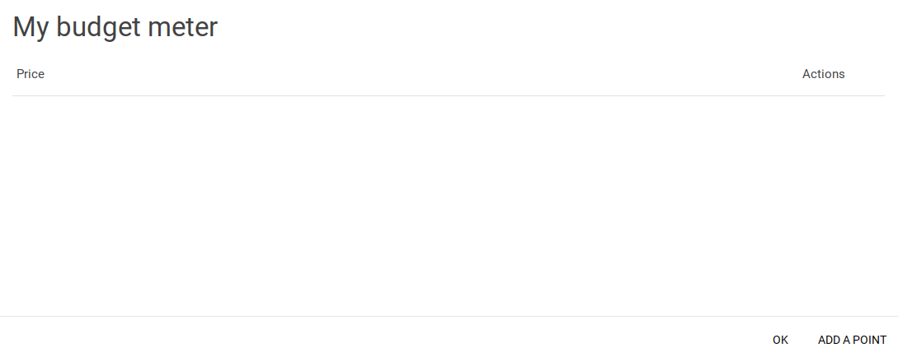

# "No data in budget meter to display"

This occurs when you have nothing in your budget meter / chart. 

You can add a point by clicking on the purple icon, and clicking the green button, or pressing CTRL B

